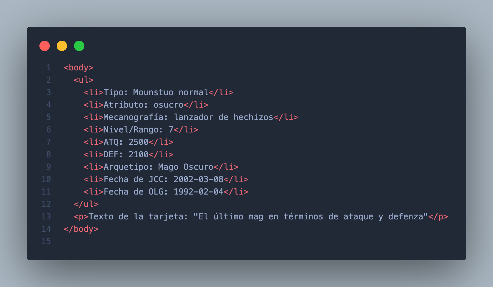

[Español](#instrucciones)

[English](#instructions)

---

# Yugimoto Deck

### Instructions

1. Clone the repository directly in the terminal.

2. Create a branch out of `develop`, from **GitHub**.

    > example: `develop-andres`-> `develop-[name]`.

3. Click on the following image where you will find a list of cards.

4. Choose a card.

5. Download the image.

6. Inside the terminal create a branch based on `develop-[name]` with the card selected.

    > example: `andres/darkMagician`

7. Create a folder:

    > example: `darkMagician` -> `[cardName]`.

8. Inside the folder, create a folder called `scripts`.

9. Inside the folder named `scripts` create a JavaScript file.

    > example: **index.js**

10. Inside the `[cardName]` folder, create a folder called `styles`.

11. Inside the folder named `styles` create a CSS file.

    > example : **styles.css**

12. Inside the `[cardName]` folder, create a folder called `assets` and save the image downloaded.

    > example: `darkMagician/assets/darkMagician.png` -> `[cardName]/assets/[file]`.

13. Inside the `[cardName]` folder, create an HTML file.

    > example : **index.html**

14. In the **index.html** file should has the same information of the card selected as it is shown in the next image.

    > example: 

15. The information added must be the same as the information found in the link.

16. Save, add, comment and upload changes to **GitHub**.

17. Create a PR pointing to `develop-[name]` with title.

    > example: `Dark Wizard added` -> `[cardName] added`.

18. Track the PR (updates, comments, changes).

19. ***Add at least 2 more cards***.

---
### Instrucciones

1. Clonar el repositorio directamente en la terminal.

2. Crear una rama que salga de `develop`, desde **GitHub**.

    > ejemplo: `develop-andres` -> `develop-[nombre]`.

3. Dar click en la siguiente imagen donde se encuentra un listado de cartas.

4. Escoger una carta.

5. Descargar la imagen.

6. Dentro de la terminal crear una rama basada en `develop-[nombre]` con el nombre de la carta elegida.

    > ejemplo: `andres/magoOscuro` -> `[nombre]/[nombreCarta]`

7. Crear una carpeta:

    > ejemplo: `magoOscuro` - `[nombreCarta]`

8. Dentro la carpeta `[nombreCarta]`, crear una carpeta llamada "scripts".

9. Dentro de la carpeta llamada `scripts` crear un archivo JavaScript.

    > ejemplo: **index.js**

10. Dentro de la carpeta `[nombreCarta]`, crear una carpeta llamada "styles".

11. Dentro de la carpeta llamada `styles` crear un archivo CSS.

    > ejemplo : **styles.css**

12. Dentro la carpeta `[nombreCarta]`, crear una carpeta llamada `assets` y guardar la imagen.

    > ejemplo: `magoOscuro/assets/magoOscuro.png` - `[nombreCarta]/assets/[archivo]`

13. Dentro la carpeta `[nombreCarta]`, crear un archivo HTML.

    > ejemplo : **index.html**

14. El archivo **index.html** deberá contener la información de la carta así como se muestra en la siguiente imagen.

    > ejemplo: 

15. La información agregada deberá coincidir con la información que se encuentra en el link.

16. Guardar, agregar, comentar y subir cambios a **GitHub**.

17. Crear un PR apuntando a `develop-[nombre]` con título.

     ejemplo: `Mago Oscuro agregado` - `[nombreCarta] agregado`

18. Dar seguimiento al PR (actualizaciones, comentarios, cambios).

19. ***Agregar al menos 2 cartas más***
